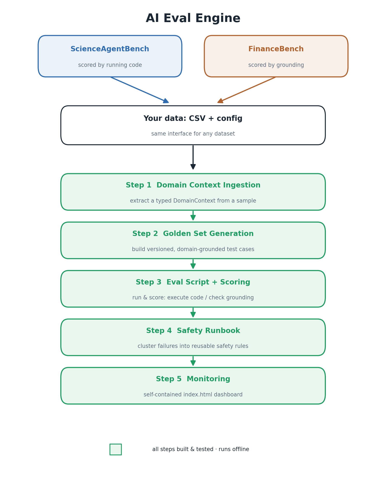

# AI Eval Engine

**Domain-aware evaluation for production AI agents.**

[](LICENSE)


Generic evaluation tools (RAGAS, DeepEval, Arize/Opik) measure hallucination rate, latency,
and token cost — but not *domain correctness*: did the agent do the right thing for **this**
schema, **these** documents, **this** user story? Hand-labeled golden sets answer that, but
they go stale the moment data, prompts, or use cases change.

AI Eval Engine treats evaluation as a **pipeline to be generated**, not an artifact to be
authored. You point it at where your domain lives; it ingests the domain context, generates a
versioned golden set, emits a runnable eval script, and accumulates a living Safety Runbook of
failures discovered from how the agent actually behaves.

> This is the software companion to the SciPy 2026 Proceedings paper
> *"Solving the AI Eval Gap: Domain-Aware Evaluation for Production AI Agents."*
> It is independent open-source work.

---

## How it works



Two very different datasets — **ScienceAgentBench** (scored by running code) and
**FinanceBench** (scored by grounding) — enter through the *same* interface: a CSV plus a
small config, and come out as a golden set, an eval script, an accumulating runbook, and a
dashboard. All five steps run offline (Step 1's live extraction needs an API key; the rest
don't). Regenerate the figure with [`images/figure1_pipeline.py`](images/figure1_pipeline.py).

---

## Install

Python 3.11+:

```sh
git clone https://github.com/sbisen/ai-eval-engine.git
cd ai-eval-engine
python3.11 -m venv .venv
.venv/bin/pip install -e ".[dev]"
```

This installs the `ai-eval-engine` command-line tool and the importable
`ai_eval_engine` package.

## Quick start

### 0. Get a dataset

The configs in `configs/` expect a single CSV per dataset:

- `configs/scienceagentbench.yaml` → `data/scienceagentbench/tasks.csv` — **already in this repo**
  (ScienceAgentBench is CC-BY-4.0; see [`data/scienceagentbench/NOTICE`](data/scienceagentbench/NOTICE)).
- `configs/financebench.yaml` → `data/financebench/financebench.csv` — **download it yourself**
  (FinanceBench is CC-BY-NC-4.0, NonCommercial, so it is not committed).

See [`data/README.md`](data/README.md) for the download-and-convert recipe and the expected
columns. So the ScienceAgentBench anchor demo runs out of the box; FinanceBench needs one
download step.

### 1. Inspect the deterministic sample — *offline, no API key, no cost*

The reproducibility backbone of Step 1 is a deterministic, optionally stratified sampler.
Once the dataset CSV is in place you can run it (and see the exact prompt that would be sent
to the model) without any API access:

```sh
ai-eval-engine sample --config configs/financebench.yaml
```

Add `--json` to emit the sampled rows, or `--show-prompt` to print the full model prompt.

### 2. Extract a DomainContext — *requires an Anthropic API key*

```sh
export ANTHROPIC_API_KEY=sk-ant-...
ai-eval-engine extract --config configs/financebench.yaml --out financebench_context.json
```

This draws the stratified sample and asks Claude to extract a typed `DomainContext`
(taxonomy + safety constraints + quality signals). Cost is ~$0.10 per run on Claude Opus 4.8.

### 3. Build the full eval bundle (Steps 2–5) — *offline, no API key*

One command turns a dataset into a complete domain-aware eval bundle:

```sh
ai-eval-engine build --config configs/financebench.yaml --out out/financebench
```

This writes four artifacts into `out/financebench/`:

| File | What it is |
|------|------------|
| `golden_set.json` | **Domain-aware golden set** — versioned, content-addressed test cases derived from the dataset's own gold labels (+ safety cases if you pass `--context`). |
| `eval_<project>.py` | A standalone, editable **eval Python script** — wire `predict()` to your agent and re-run. |
| `runbook.json` | The **itemised Eval Context Runbook** — failures clustered by category/type, with occurrence counts that **accumulate every run**. |
| `index.html` | A self-contained **monitoring dashboard** (open in any browser) — domain accuracy, pass rate, safety score, grounding, per-domain breakdown, run trend, and the runbook. |

Re-running (`python out/financebench/eval_financebench-qa-agent.py --baseline`, or `build`
again) appends a run, grows the runbook, and refreshes the dashboard trend. It runs offline
because both demo datasets ship gold labels; pass `--predictions preds.json` to score a real
agent. `--gold-baseline` uses near-perfect predictions as a harness sanity check.

To stop at Step 2 and just inspect the generated golden set, use `golden` (offline):

```sh
ai-eval-engine golden --config configs/financebench.yaml --context financebench_context.json --out golden_set.json
```

### Cold start: no dataset yet, only the agent's spec

When a project has no labeled data, point a `type: text` source at the agent's spec files
(system prompt, tool definitions, user stories) and run Step 1 on those instead of a CSV —
Claude infers a `DomainContext` from intent and tool side-effects:

```sh
ai-eval-engine sample  --config configs/support_agent_spec.yaml   # offline, inspect the prompt
ai-eval-engine extract --config configs/support_agent_spec.yaml   # extract the DomainContext
```

Only Step 1 runs from a text source; Steps 2–5 still need labeled rows from a CSV source.
The single model call goes through a pluggable `LLMBackend` (default `AnthropicBackend`), so
any provider — including local/open models — can be swapped in.

### Use it from Python

```python
from ai_eval_engine import load_csv_sample, load_config, extract_domain_context

# Offline: reproduce the exact Step-1 sample.
config = load_config("configs/financebench.yaml")
sample = load_csv_sample(config.domain_sources[0], "configs", config)

# Online: extract the structured domain context.
context = extract_domain_context("configs/financebench.yaml")
print(context.model_dump_json(indent=2))

# Steps 2-5 in one call (offline).
from ai_eval_engine import build
paths = build("configs/financebench.yaml", "out/financebench")
print(paths["dashboard"])  # -> out/financebench/index.html
```

## Use it on your own dataset

The engine is dataset-agnostic. Point a config at any CSV and declare a `task` block that
names the columns and the scoring mode — that's the whole contract:

```yaml
project: my-support-agent
domain_sources:
  - type: csv
    path: ../data/my_tickets.csv
stratify_by: topic
task:
  kind: grounded_qa          # or: code_execution
  id_field: ticket_id
  input_field: question
  gold_field: answer
  grounding_field: evidence  # optional; enables the grounding score
  category_field: topic
```

`ai-eval-engine build --config my.yaml --out out/mine` then produces the same four artifacts.
`grounded_qa` scores answers by correctness + grounding in the cited evidence; `code_execution`
scores by **actually running** the predicted Python program.

## How it maps to the paper's five steps

| Step | What it does | Status |
|------|--------------|--------|
| **1. Pluggable Domain Context Ingestion** | Sample a source; Claude extracts a typed `DomainContext`. | ✅ Built & tested |
| **2. Automated Golden Set Generation** | Versioned, content-addressed golden set from the data's gold labels. | ✅ Built & tested |
| **3. Eval Script Generation + Scoring** | Standalone eval script; scores correctness / grounding / execution. | ✅ Built & tested |
| **4. Agentic Safety Runbook** | Itemised JSON runbook; failures cluster and **accumulate** across runs. | ✅ Built & tested |
| **5. Post-Launch Monitoring Dashboard** | Self-contained `index.html`: accuracy, safety, grounding, trend, coverage. | ✅ Built & tested |

Steps 2–5 run **fully offline and deterministically** (both demo datasets ship gold labels).
Step 1's live extraction needs an API key; the rest do not. The optional LLM upgrades — golden-set
expansion with adversarial cases, and an LLM grounding judge — layer on top of the offline core.

Demonstration datasets target execution- and grounding-verifiable tasks — **ScienceAgentBench**
(scientific Python code, execution-scored) and **FinanceBench** (financial document QA,
grounding-scored) — chosen so the agent fails without the ingested domain context, which keeps
the LLM-generates-and-judges pipeline honest against self-bias.

## Development

```sh
.venv/bin/python -m pytest      # run the offline test suite (no API key needed)
.venv/bin/ruff check .          # lint
```

The sampling, prompt construction, config, and schema layers are all covered by tests that run
without network access or an API key.

## Project layout

```
ai_eval_engine/      # the library
  config.py          #   YAML project config + TaskSpec + Csv/Text sources (Pydantic)
  sampling.py        #   deterministic / stratified CSV sampling (offline)
  artifacts.py       #   text-source (cold-start) artifact loading (offline)
  domain_context.py  #   Step 1: DomainContext schema + extraction
  llm.py             #   pluggable LLMBackend seam (default AnthropicBackend)
  golden_set.py      #   Step 2: versioned golden-set generation
  evaluation.py      #   Step 3: scorers (grounded_qa / code_execution) + run_eval
  eval_script.py     #   Step 3: generate a standalone eval runner
  runbook.py         #   Step 4: accumulating safety runbook
  dashboard.py       #   Step 5: self-contained HTML dashboard
  pipeline.py        #   build(): Steps 2-5 end-to-end
  cli.py             #   `ai-eval-engine` command-line interface
configs/             # project configs (ScienceAgentBench, FinanceBench, support-agent)
data/                # datasets (downloaded, not committed — see data/README.md)
examples/            # runnable quickstart script + support_agent cold-start spec
tests/               # offline pytest suite (63 tests)
```

## Citation

If you use this software, please cite it via [`CITATION.cff`](CITATION.cff).

## License

MIT © Shivika Bisen
